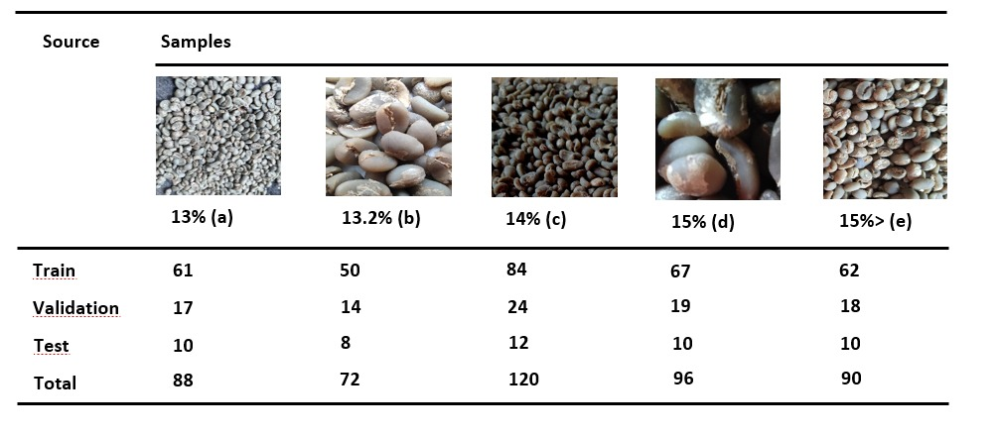
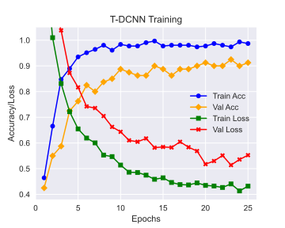

  

**Coffee Beans Moisture Detection with Fusioned Triple Deep Convolutional Neural Network**

- **Authors:  [Ivan Arsyaditya Prananda][2], [Mohamad Arsya Kaukabi][3], and [Muhammad Naufal Ariiq][5]**

- **Affiliation: [Bangkit Academy][4]**

- **E-mail: arsyakaukabi@gmail.com**

## Graphical Abstract

    <b>Fig 1</b> Triple deep convolutional neural network model for moisture level detection

## Dataset
**The dataset for this work is manually collected by [our team][1].**

The dataset used for this work is images of green coffee beans with different moisture. There is 5 different classification:

There are total 416 images splitted into train_data, validation_data, and test_data.
You can find the dataset here: **<a target=blank_ href="https://drive.google.com/drive/folders/1WaI9rQo7gBEZzdL7b40X_ciEuAy9DC-R?usp=sharing">Google Drive Prepared Dataset<a/>**

`Dataset Size : 411MB`

[1]:(https://github.com/arsyakaukabi/Co-ffee_BangkitCapstone)
## Models
Transfer learning and model fusion is used in this work. There are 3 fusioned model :
- InceptionV3
- VGG16
- DenseNet121

**For an immediate simulation without the hassle of going over the previous instructions, refer to this link:**

 **<a href="https://drive.google.com/file/d/11ycNNk1YWZGSVtpbrCJ3zwIBZgwxd7ai/view?usp=sharing">Pre-Trained Weights</a>**

`PRE-TRAINED WEIGHTS FILESIZE: (344 MB)`

## How To Use
1. Open the `TDCNN_1.ipynb` file in `Co-ffee_MoistureDetection/Model Trainer/`
2. Import all the required libraries.
3. Build the model with transfer learning of `InceptionV3`, `VGG16`, and `DenseNet121`. 
4. Fuse the previous three transfer learning model into one model and make sure when all this three is fused, they have the same input layer.
5. Download the dataset from the [link](https://drive.google.com/drive/folders/1WaI9rQo7gBEZzdL7b40X_ciEuAy9DC-R?usp=sharing) and load it into `ImageDataGenerator` with `.flow_from_directory`
6. Start the training.
7. After all T-DCNN models are built, you may now run the `testing.py` from the main `Co-ffee_MoistureDetection/` folder.
8. Follow through the given instructions and make sure to use the test sample from the provided `/test/` folder
## Results

    
    

    <b>Fig 2</b> Accuracy and loss graph after 25 epochs.

## Co-ffee Github Repo Links ##
###
**Machine Learning**
>**[Classification of Coffee Leaf Diseases](https://github.com/arsyakaukabi/Co-ffee_A)**

>**[Green Coffee Beans Moisture Level Detection](https://github.com/ivandityap/Co-ffee_MoistureDetection)**

**Cloud Computing**
>**[Disease classification API](https://github.com/xrizer/Co-ffee-Desease-API)**

>**[Coffee beans Moisture level detection API](https://github.com/xrizer/Co-ffee-Desease-API
)**

**Mobile Development**

>**[Project Android Studio](https://github.com/Rizalfirman165/co-ffee)**

## Acknowledgment ##
Thanks to [Bangkit Academy][4]. Without its support, this work would not have become possible.

[2]:https://www.instagram.com/arsyakaukabi/
[3]:https://www.instagram.com/ivnvan_/
[4]:https://grow.google/intl/id_id/bangkit/
[5]:https://www.instagram.com/muhammadnaufalariiq/
